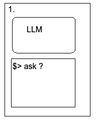
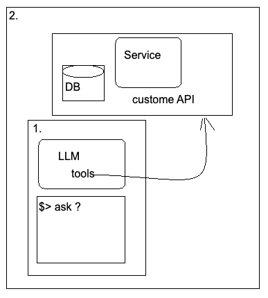
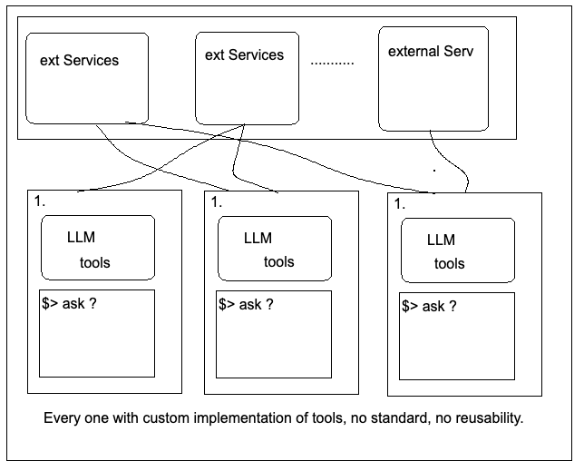
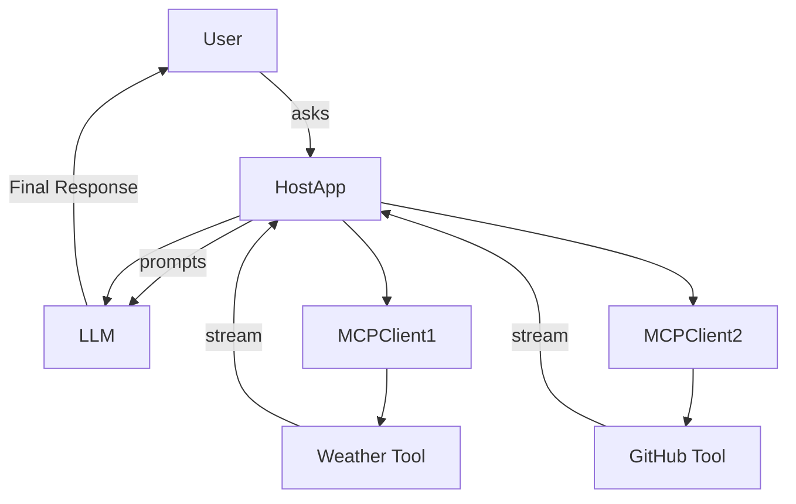

---

marp: true
paginate: true
backgroundColor: #fff
---------------------

# MCP Presentation

### Making Tool Use by LLMs Scalable, Standard, and Smarter

---

## Simple User Prompt to LLM

* User asks a question
* Prompt is passed to the LLM
* LLM generates a response from its internal knowledge

**Example:**

> "What is the capital of France?"  → LLM replies: "Paris"

---

## When LLM Lacks Information

* User asks about something the model was not trained on (e.g., real-time data)
* LLM cannot answer accurately

**Example:**

> "What is the weather in Amsterdam right now?"  → LLM doesn't know

**Solution:** Use tools/APIs to fetch real-time data

---

## Problem at Scale

---

## Problem at Scale
* Multiple APIs, services, databases
* Each tool has its own interface
* Hard to maintain and integrate
* Leads to prompt engineering mess & duplication

**Challenges:**

* Tool registration
* Input/output formatting
* Consistent communication

---

## Enter MCP (Model Context Protocol)

* Open standard designed to simplify tool use by LLMs
* Standardizes how tools are:

  * Described (schemas)
  * Called (JSON-RPC)
  * Communicated with (HTTP + SSE or stdio)

**Goal:** Reusable, model-agnostic, and scalable tool integration

---

## MCP Protocol Diagram

---

## Rise of MCP Servers

* MCP servers wrap existing APIs or business logic
* Follow a standard schema + communication model
* Can be:

  * Local (FastAPI + JSON-RPC over stdio)
  * Remote (FastAPI + HTTP + SSE)

**Examples:**

* Travel Advisory Service
* Weather API
* Forecast API

---

## Benefits in Agentic Systems

* Agents can dynamically discover and use tools
* Consistent tool interface
* Reduced hallucination
* Enables chaining tools
* Works with local models (e.g., Ollama + LangChain)

**Also usable in:**

* Standalone apps
* Embedded LLM assistants
* Hybrid on-device/cloud agents

---

## Conclusion

> "As LLMs evolve from answer engines to decision engines, MCP provides the missing bridge between reasoning and real-world action."

* Simple, scalable, pluggable
* Easy to prototype (LangChain, FastAPI)
* Designed for both local and remote tools
* Empowers devs to build powerful, modular AI systems

---

## Demo

* Show architecture of demo app:

  * Services: weather, forecast, advisory
  * MCP-style tools
  * LangChain agent using them via local API

---
